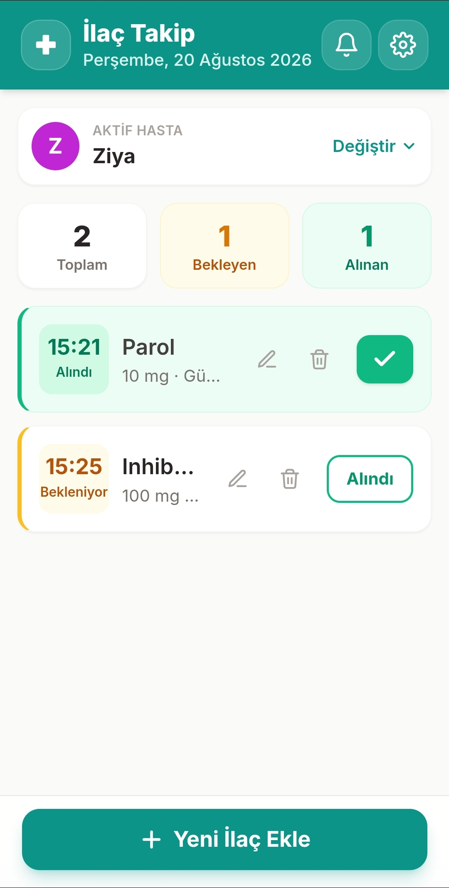
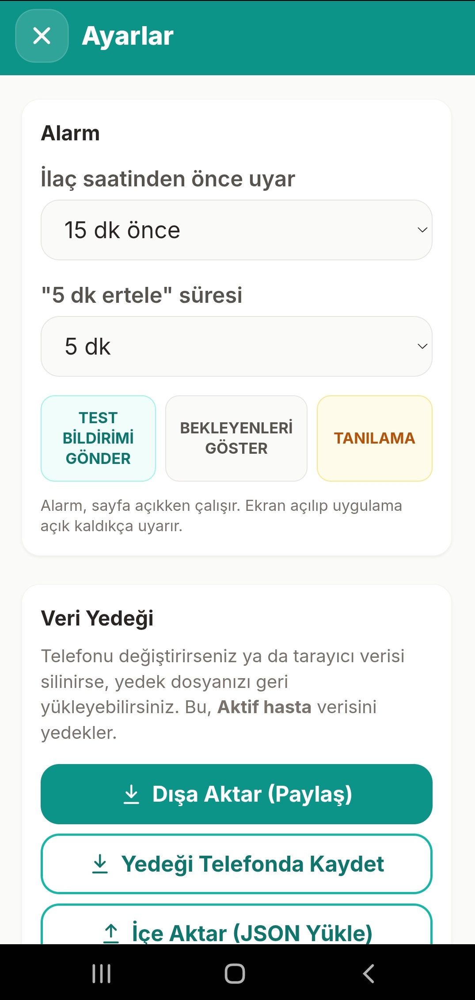

# İlaç Takip

İlaçlarınızı kaçırmamanız için çalışan, hasta başına PIN korumalı, çoklu hasta destekli bir Android/PWA hatırlatıcı uygulaması.

## Özellikler

- Çoklu hasta yönetimi (her hasta için ayrı ilaç listesi)
- İsteğe bağlı PIN koruması (4–6 haneli)
- İlaç ekleme / düzenleme / silme
- Saatlerde otomatik alarm ve bildirim
- Önce uyarı süresi ayarı (0–45 dk)
- Erteleme (5 / 10 / 15 / 20 / 30 dk)
- Alındı takibi + günlük özet
- Veri yedeği (dışa aktarma / içe aktarma / telefonda klasöre kaydetme, JSON)
- Arka planda çalışan native Android bildirimleri
- Tam zamanlı alarm (Exact Alarm) desteği
- Android 12+ `SCHEDULE_EXACT_ALARM` izni kontrolü
- Android 13+ `POST_NOTIFICATIONS` izni desteği
- Full-screen intent ile ekran açma + uygulamayı öne getirme + yüksek öncelikli titreşimli alarm
- Alındı işaretinde alınan saatin kartta kalıcı gösterimi
- PWA + Capacitor Android (APK)

## Teknoloji Yığını

| Katman | Teknoloji |
|--------|-----------|
| Arayüz | HTML5 + Tailwind CSS (Play CDN) |
| Mantık | Vanilla JS (ES2019), esbuild ile paketlenir |
| Depolama | LocalStorage |
| Native | Capacitor 6 |
| Bildirim | `@capacitor/local-notifications` |
| Alarm | Custom `@ilac/exact-alarm` plugin (Android 12+) |
| Build | Gradle + GitHub Actions |

## Kurulum (Yerel)

```bash
# Bağımlılıklar
npm install

# PWA sunucu (localhost:8000)
npm start

# JS paketleme
npm run build

# Android ekle (ilk seferde)
npx cap add android

# Senkronize et
npx cap sync android

# Android Studio ile aç
npx cap open android
```

## APK Oluşturma (GitHub Actions)

Ana dal'a (`main`) her push'ta otomatik olarak debug APK derlenir:

1. Web varlıkları esbuild ile paketlenir (`npm run build`)
2. Capacitor senkronize edilir (`npx cap sync android`)
3. Android izinleri enjekte edilir
4. Gradle ile debug APK derlenir
5. APK, GitHub Actions artifacts olarak yüklenir

> **Not:** Tam zamanlı alarm için Android 12+ cihazlarda uygulamayı ilk açarken `Ayarlar > Uygulamalar > İlaç Takip > Tam zamanlı alarm` iznini açın. Android 13+ cihazlarda ek olarak `POST_NOTIFICATIONS` izni istenecektir.

## Proje Yapısı

```
ilac_takip/
├── app.js                  # Tüm uygulama mantığı (ES module)
├── www/
│   ├── index.html          # PWA şablonu
│   ├── app.bundle.js       # esbuild çıktısı
│   ├── style.css           # Özel stiller
│   └── sw.js               # Service Worker
├── plugins/
│   └── exact-alarm/        # Android Exact Alarm custom plugin
├── android/                # Capacitor Android projesi
├── docs/
│   └── screenshots/        # Uygulama ekran görüntüleri
├── .github/workflows/      # CI/CD
├── package.json
├── capacitor.config.json
└── scripts/
```

## Ekran Görüntüleri




## Lisans

MIT
